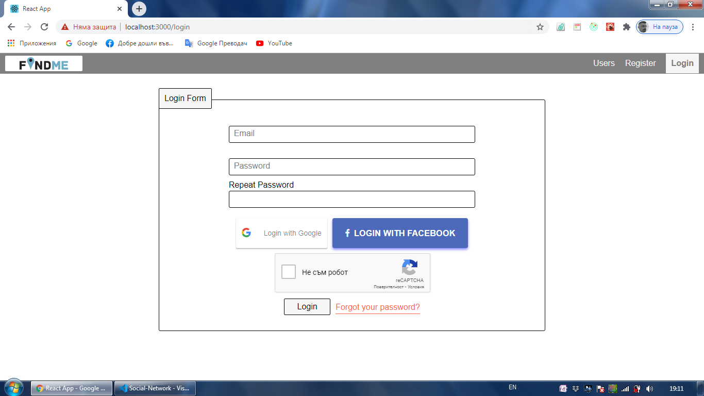

This project was bootstrapped with [Create React App](https://github.com/facebook/create-react-app).

## About Project

The idea of this project is to try to implement and using the MERN stack. It is made for educational purposes only and nothing else!
The users can register with their credentials or login with Facebook or Google. If user forgot its password, there is reset password option. User can upload your profile picture, add personal information and create posts with picture if needed. You can find friends and follow them on platform. After following them, you are able to see their most recent posts. The posts can be liked, commend or deleted. There is Admin panel which contain statistics and diagrams.

## Screenshots

**LandingPage:**

-

**LoginPage:**

-

**RegisterPage:**

-

**ForgotPassword:**

-

**ResetPassword:**

-

**AdminPanel:**

-

**HomePage:**

-

**PostsPage:**

-

**CreatePost:**

-

**UsersPage:**

-

**UserProfilePage:**

-

**UsersPosts:**

-

**PersonalInfoForm:**

-

**UserFollowings:**

-

**PostPage:**

-

**PostsComments:**

-

**ResponsiveView:**

-

**NotFoundPage:**

## Technologies

FRONTEND

- Javascript library for building User Interfaces: `React`
- Performant, flexible and extensible forms with easy-to-use validation: `react-hook-form`
- Handling time properly: `momentjs`
- JavaScript library for managing application state: `Redux`
- Asynchronous Redux Actions: `Redux Thunk`
- JavaScript library for data visualization, with chart types: `Chart.js`

BACKEND

- The NoSQL database for modern applications: `MongoDB`
- Elegant MongoDB object modeling for node.js: `Mongoose`
- Authentication built on top of tokens: `jsonwebtoken`
- Image Upload: `multer`
- Send Emails: `nodemailer + SendGrid`

## Setup the Project

1)cd frontend
Copy the .env.example file into .env.local and fill in the actual values (to use recaptcha, Facebook login and Google login, you need to create accounts and get: fb appid, google clientid, recaptcha sitekey)

- npm install -> npm start
- Open https://localhost:3000 to view it in the browser.

  2)cd backend
  Copy the .env.example file into .env and fill in the actual values (to use send emails, you need to create sendgrid account)

- npm install -> npm start

And you are ready! :)
